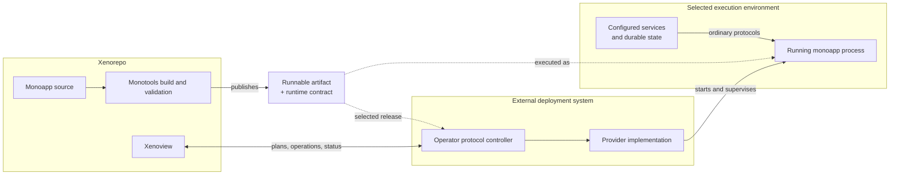

# Deployment-independent runtime boundary

Status: revised architectural proposal; no new runtime contract is implemented.

## Guiding decision

Neither a monoapp nor Xenorepo/Monotools knows how it is deployed. Deployment
belongs to an external operator that consumes an ordinary runnable artifact.
Adding, changing or removing a deployment system requires no changes here.

The membrane is the application's execution boundary: process behavior,
configuration, service protocols and observable health. It is not a deployment
API in Monotools. Monotools may build, validate and document that boundary;
it does not select targets, negotiate their capabilities or manage deployments.

The external operator may use Fargate, a self-hosted system or a future mechanism.
These are examples of consumers, not targets enumerated by Xenorepo. The app
does not register with a deployment service or call back into an operator SDK.
The runtime must work when its operator is unavailable.

Xenoview is the human control surface for deployments. It talks to an external
deployment controller through an operator protocol; it does not import target
adapters or execute provider tools. Xenoview therefore knows that deployments,
releases and operations exist, while remaining ignorant of how any deployment
is implemented.

This distinction is deliberate: deployment is Xenoview product behavior, not a
Monotools orchestration responsibility and not part of a monoapp's runtime.

## What crosses the boundary

| Surface | Application responsibility | Environment responsibility |
| --- | --- | --- |
| Artifact | Reproducible code, built frontend, pinned dependencies and documented entrypoint | Obtain and execute a compatible artifact |
| Process | Listen on a configurable address/port, handle termination, expose meaningful exit status | Start, supervise, stop and resource the process |
| Configuration | Define and validate required values | Supply values and secrets at execution time |
| Dependencies | Use explicit service protocols and supported semantics | Supply reachable services satisfying those semantics |
| Health | Report liveness and bounded readiness accurately | Decide routing, restart and rollout actions |
| State | Identify durable state, scratch use, schema and concurrency constraints | Preserve data and arrange compatible storage, backup and placement |
| Diagnostics | Emit useful, secret-free logs and runtime signals | Collect, retain and present them |

Reuse existing app metadata, build routines, environment configuration,
FastAPI construction and SQLAlchemy configuration as the authoritative sources.
Expose required runtime facts from those sources rather than creating a second
deployment manifest. Ordinary documentation is sufficient until an independent
consumer demonstrates a need for machine-readable metadata.

OCI is a useful standard packaging option, not the definition of the membrane.
A direct process and a container can satisfy the same execution contract.
Packaging must preserve existing module resolution and include the required
Monotools version without requiring a live Xenorepo checkout or control plane.
An external operator may wrap the artifact in its preferred packaging.

## Dynamic binding

The app names a dependency by its function and speaks its protocol. The
environment supplies its address and credentials at execution time. For
example, an existing database URL can point at a managed database or a database
on a private server without the app knowing who operates it. Rebinding normally
takes effect on process restart; hot reconfiguration is a separate requirement.

Do not select implementations using a provider name, deployment-mode flag,
cloud metadata probe or target capability handshake. Configuration describes
the resource the app uses, not how that resource was provisioned. The external
operator decides whether the available resources can satisfy the contract.

Protocol compatibility includes behavior: transactions, delivery guarantees,
locking and durability must actually match. A generic-looking URL cannot make
different semantics interchangeable. New dependency abstractions still require
independent consumers under `LIBRARIES.md`; do not invent universal storage,
queue or hosting interfaces in anticipation of future needs.

Configuration injection may be backed by any secret store; the app receives
values through its ordinary configuration boundary. HTTP ingress may be
implemented anywhere; the app sees HTTP/WebSocket traffic and explicitly trusted
proxy information. Infrastructure identity and topology stay outside.

## Current runtime gaps

- `runtime/application.py` returns unconditional success from `/health`.
  Separate process liveness from readiness to serve requests, including required
  dependencies and schema compatibility. These meanings apply in every runtime.
- `persistence/database.py` creates schema during session-factory construction.
  Define repeatable, serialized schema preparation and a compatibility check
  independently of server startup. An external operator chooses when to invoke
  preparation; app/Monotools persistence code owns its correctness and evidence.
- `runtime/realtime.py` keeps socket registrations in process memory. Document
  that independent processes do not share delivery. An operator must respect
  that constraint, including replacement overlap. Add distributed delivery only
  when a product requires it, not because a host can start multiple replicas.
- Durable data must survive process replacement. Preserve the existing database
  configuration boundary. SQLite and PostgreSQL have different operating
  constraints; document and verify supported behavior without choosing a
  database according to deployment provider.

These are runtime correctness obligations, not reasons for apps to know about
replica schedulers, migration jobs, persistent-volume classes or load balancers.

## Ownership and proof

Deployment plans, provider adapters, resource provisioning, image registries,
replica counts, routing policy, rollout decisions, operation journals, rollback
and disaster recovery execution belong to the external deployment controller.
Do not add those to `monotools/orchestration/` or
`monotools/provisioning/`. Existing deployment tools may implement the controller.

### Xenoview operator protocol

The protocol is an integration owned by Xenoview and implemented outside this
repository. Configure its base URL and credentials like any other dependency.
Keep the first contract small and resource-oriented:

- list environments and deployments with stable opaque identifiers;
- inspect desired and observed release, public endpoints, health, and timestamps;
- request a plan for changing a deployment to an immutable release;
- apply an unexpired plan using its identifier and fingerprint;
- observe the resulting long-running operation, diagnostics, and recovery actions;
- request rollback by selecting an earlier compatible release; and
- follow bounded, redacted logs or diagnostic links when offered.

Mutation is asynchronous and idempotent. Every request carries a caller-chosen
idempotency key; every accepted mutation returns an operation identifier.
Xenoview persists identifiers and last observations so refreshes and restarts do
not duplicate work. A timeout produces an unknown outcome that must be resolved
by observing the operation. Xenoview never infers success from request acceptance.

Plans are immutable snapshots with a fingerprint, expiry, stated effects, risks,
and whether service interruption is expected. Applying a stale or changed plan
fails closed. The controller reports normalized phases and human-readable facts,
but remains authoritative for provider-specific state and recovery. Provider
details may be returned as labeled diagnostics for people; Xenoview does not
branch on them.

Capabilities are expressed as available actions and forms on each resource.
Xenoview renders only offered actions instead of maintaining a matrix of target
types. A controller that cannot roll back simply offers no rollback action and
explains the constraint. This allows the protocol to grow without teaching
Xenoview about deployment methods.

The protocol carries release references rather than building application code.
How a controller resolves or constructs an executable artifact is its concern.
Authentication, authorization, audit identity and secret redaction are enforced
by the controller and represented clearly by Xenoview. Xenoview's existing
same-origin protection still governs browser-to-Xenoview mutations.

Xenorepo verifies the artifact's runtime behavior through root `manage.py`, using
routinized Python checks with Rich/Typer and visible ignored per-app `data/`.
Cover missing configuration, unavailable dependencies, startup, termination,
schema compatibility and documented concurrency behavior. Tests consume ordinary
processes, endpoints and configuration; they do not import deployment adapters.
Keep domain acceptance in app-owned suites and shared checks generic.

The external controller separately verifies provisioning, rollout interruption,
ingress, recovery and preservation of data. It can invoke the same portable
acceptance checks against a supplied endpoint. Backend-specific suites and
credentials live with that controller, outside Xenorepo. Runtime verification
here must not require a cloud account or knowledge of available target types.

Xenoview owns contract tests against an in-process fake operator API, covering
plans, stale plans, idempotent requests, timeouts with unknown outcomes,
operation progress, failed operations, recovery actions, authorization failures,
redaction and unavailable controllers. Those tests prove management behavior
without identifying or contacting a deployment backend. Each external
controller owns conformance tests for the same protocol against its backend.

Prove the boundary using two independent apps, including durable CRUD and
realtime, operated externally on Fargate and a self-hosted environment. For
compatible container environments, use the same image digest. Compare actual
application behavior, including dependency failure and connection recovery.
This is evidence for the boundary, not a supported-target registry in Monotools.

## Assumptions and reversal test

Evidence: existing FastAPI, environment and SQLAlchemy boundaries already hide
much of the execution environment. The runtime gaps above concern semantics
that an operator must be able to rely on regardless of deployment method.

Weakest assumption: the first apps' dependencies can be supplied with equivalent
semantics in both environments. Provider-specific integrations may need their
own independently justified boundaries. Moving execution does not move live
data or establish recovery guarantees automatically.

Inaction leaves implicit runtime assumptions. An internal provider-adapter layer
would make deployment a Monotools responsibility. The smallest intervention is
to make existing runtime obligations explicit and testable, and let external
operators consume them.

Reversal test: introduce an entirely new deployment method without modifying
monoapps, Monotools, Xenoview UI logic, or Xenorepo verification infrastructure.
Configure a conforming external controller endpoint in Xenoview; the controller
binds suitable resources and runs the existing artifact. If Xenoview needs a
provider branch or the app needs target knowledge, the boundary has failed.
