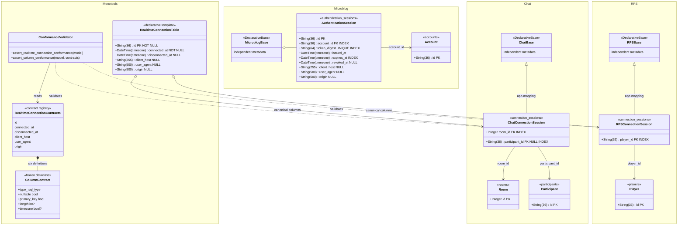

# Custom Library Catalog

This is the authoritative inventory of reusable libraries owned by this
repository. Add an entry before adopting a new shared library in an app, and
update its contract here whenever its public surface changes. Applications are
consumers; they do not import one another.

| Library | Language | Location | Public responsibility | Consumers |
| --- | --- | --- | --- | --- |
| Monotools | Python + TypeScript tooling | `monotools/`, `scripts/check-lit.mjs`, `tsconfig.frontend.json` | `monotools.appkit` assembles the typed `AppContext` boundary; the platform provides declarative lifecycle, strict app-rooted Lit graph validation, recursive frontend watching, FastAPI runtime, portable SQLAlchemy, auth/transport primitives, provider-neutral hosted-payment and mail contracts, and an SMTP adapter. | Central `manage.py` and all apps as applicable. |
| Console Lit UI | TypeScript | `packages/lit-ui/` | Reusable Lit console elements, design tokens, and chrome for browser artifacts. | Calculator, Kanban, Dispatch Ledger, and Worminal. |
| Browser Testing | JavaScript/TypeScript | `packages/browser-testing/` | Shared Playwright fixtures, strict browser diagnostics, trusted raw mouse/touch/keyboard drivers, schema-versioned input evidence, and static proof validation. Contains no app routes, selectors, entities, or gesture semantics. | Monotools framework canaries and app-owned browser suites. |

## Extraction rules

- A library has a narrow, typed public contract and no imports from an
  application. App-specific domain models, repositories, routes, and product
  behavior remain inside that app. Applications are consumers; they do not
  import one another.
- Backend libraries live in Python packages and expose transport/persistence
  primitives only after at least two applications prove the boundary.
- Frontend libraries live under `packages/`, are imported through their package
  name, and must not embed an app's API paths, state, or copy.
- Keep frontend artifact sources in `apps/<app>/frontend/` and backend/domain
  code in `apps/<app>/backend/`. The monoapp root contains administrative,
  structural, entrypoint, and informational files; `manage.py` is its only
  Python file. FastAPI remains the sole service that delivers the built
  frontend and the app API.
- Add framework-level tests for every shared contract; retain product behavior
  tests in the consuming app's test module.

## ORM template policy

- Shared ORM templates own infrastructure facts and their schema invariants;
  applications retain independent declarative bases, metadata, and databases.
- Applications extend templates with foreign keys and domain facts. They never
  import another application's models, and complete product-domain tables stay
  application-owned.
- Metadata conformance tests enforce canonical column names, types, lengths,
  nullability, and primary keys while permitting domain-specific extensions.
- Template changes may intentionally break older consumers until preserving
  deployed data makes migration compatibility economically justified. Current
  templates are the supported baseline; applications are brought forward
  deliberately.

### Current class structure

Microblog's authentication session deliberately owns its similar transport
metadata columns directly: only the six-column realtime connection boundary has
enough proven consumers to justify a shared ORM template.
